# Application Screen

### Roamood 
- Music Track Editor + Hardware Control (React Native)
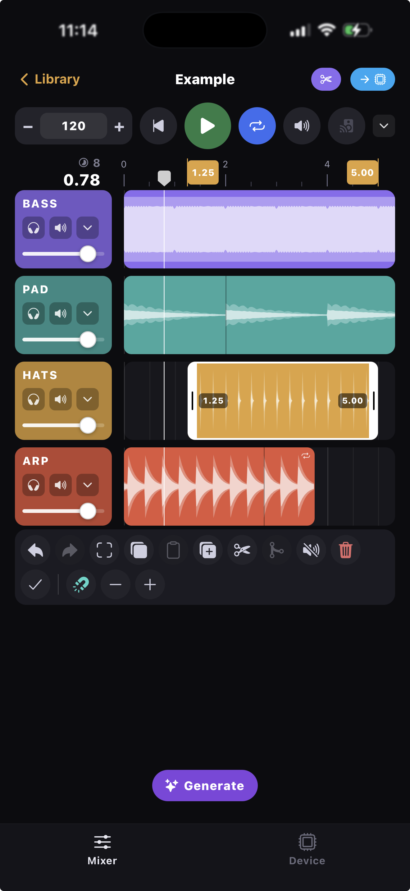
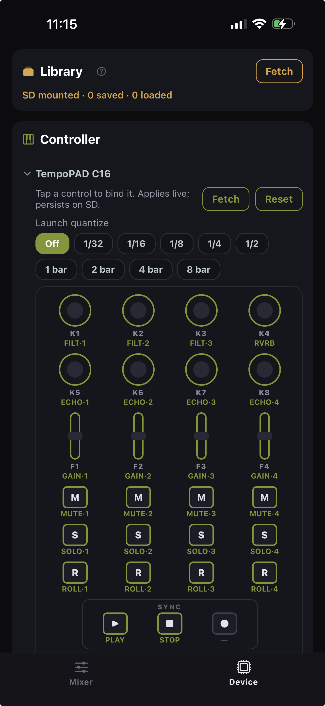
- Realtime Remixer (BLE/Wifi, Audio Process)
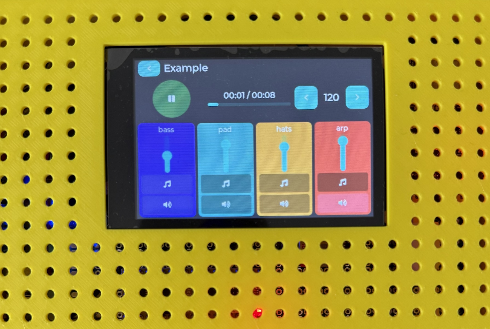

---

### Parent Control
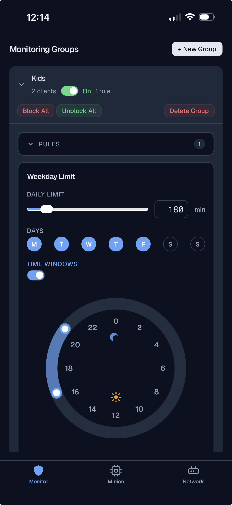
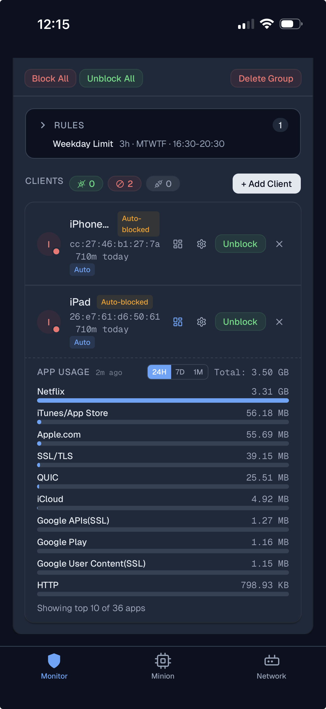

---

### Holiday Booking Screen
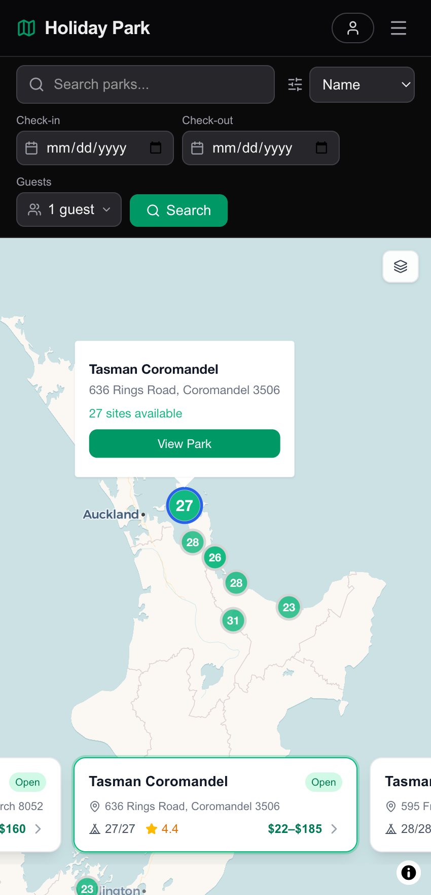

---

### Cooling Dock App Screen
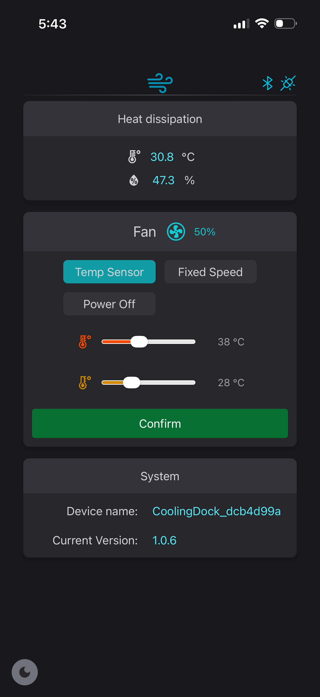

---

### Trip Planner Map Screen
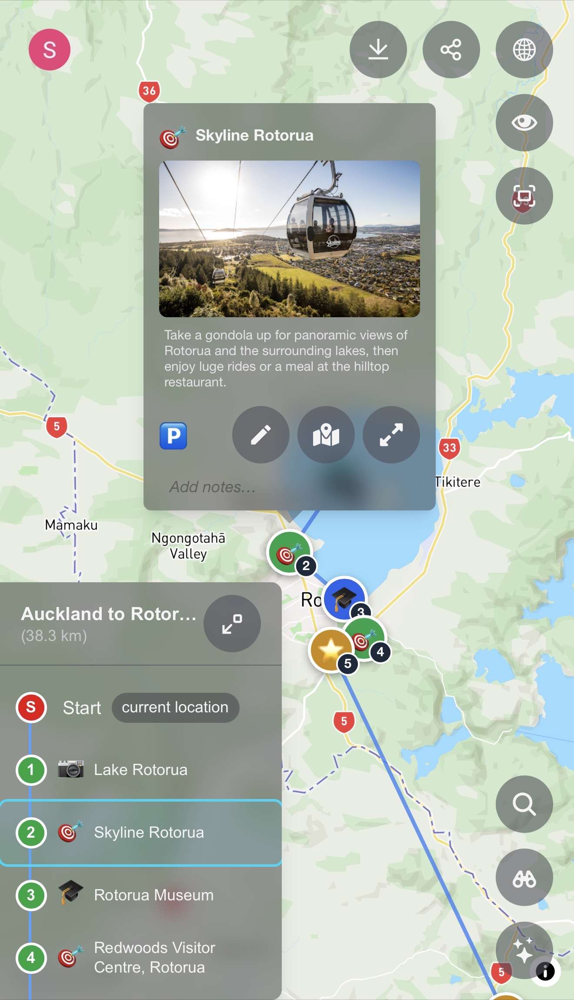

---

### SGA Screen
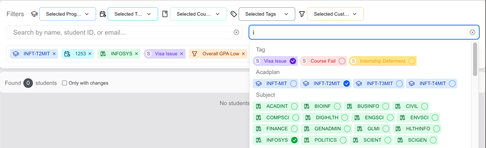
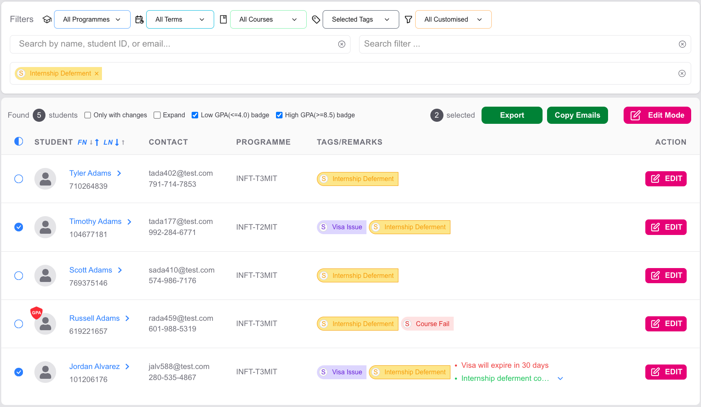
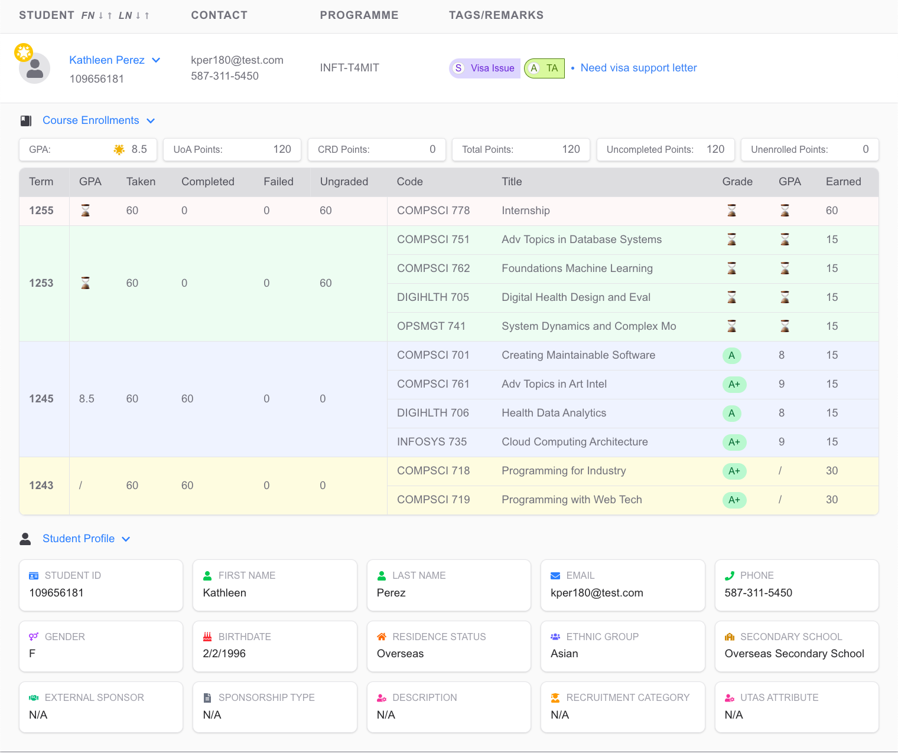

---

### Dex Frontend (Complex Web UI)
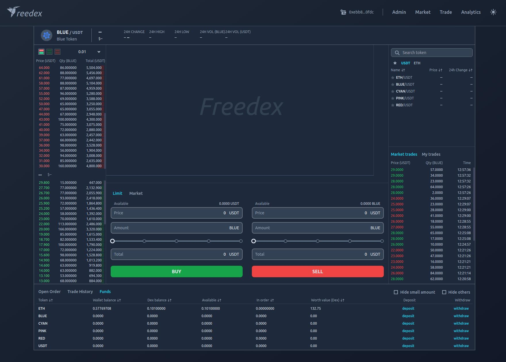

---

### Q Monitor (React Native App)
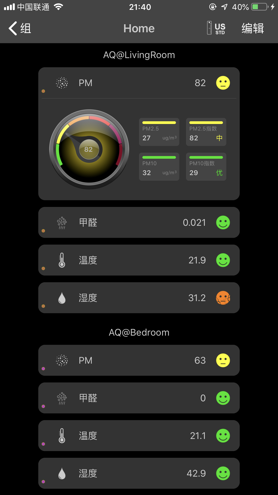

---

### BookElf (iOS Native App with Cocos2d)
https://github.com/user-attachments/assets/a3fc67a2-e2ae-4a76-bef5-0802baf6f80b

---

### Battery (Android App)
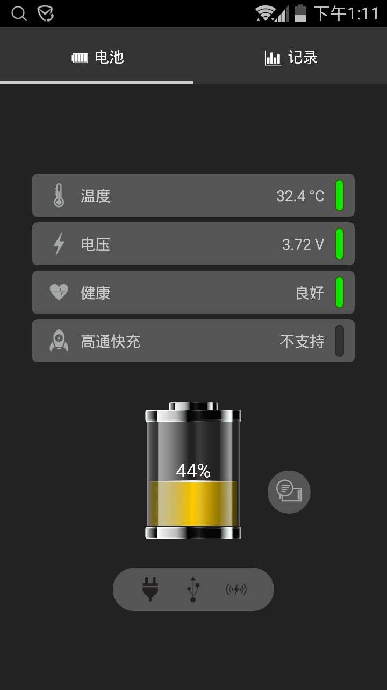
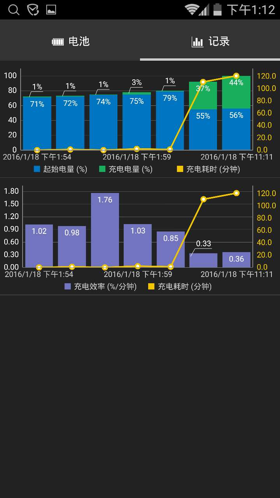

### Dehumidifer (Simple Web UI)
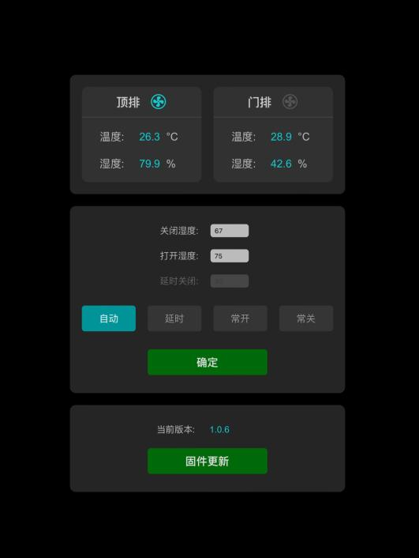

